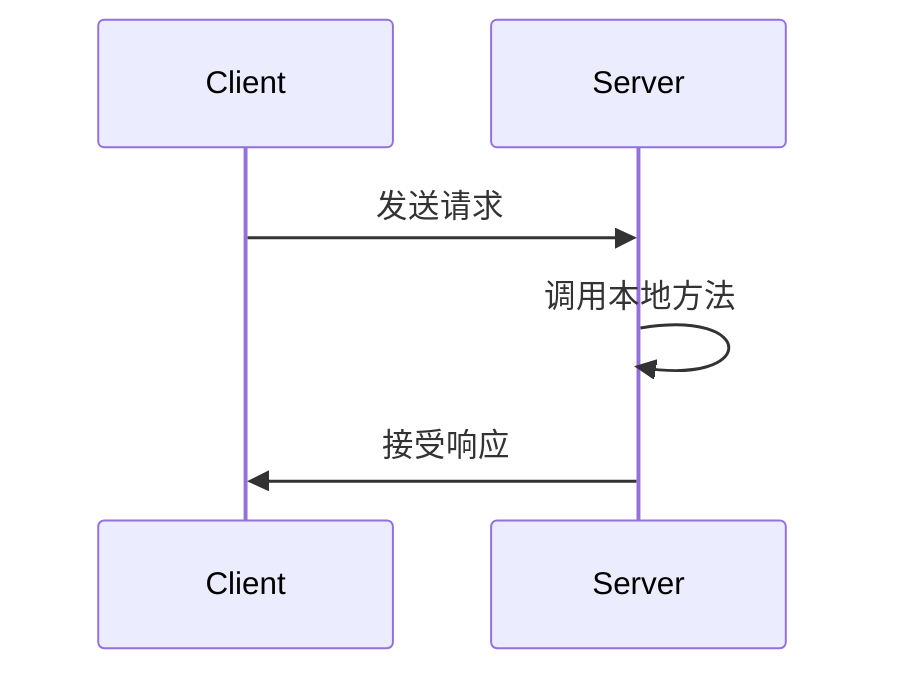
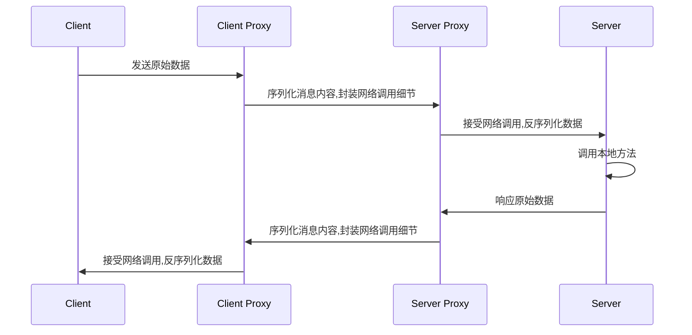

# 架构设计几问

> 为什么要写一篇架构设计的文章呢?

理由很简单,为了防止像无头苍蝇一样毫无规划地编写代码,当项目越来越大,越来越复杂的时候,想加功能都会很麻烦

所以,这一篇文章主要是先将脑中的思路整理出来,再分析其中不合理之处,再进行相应的调整

后面编写代码的时候也能有个指引的方向

> 先从最基本的概念讲起吧,这里截取百度百科的解释

RPC是远程过程调用（Remote Procedure Call）的缩写形式。SAP系统RPC调用的原理其实很简单，有一些类似于三层构架的C/S系统，第三方的客户程序通过接口调用SAP内部的标准或自定义函数，获得函数返回的数据进行处理后显示或打印。

对应Java应用来说,我们可以通过RPC在不同的进程之间调用彼此暴露的方法

> 大家先来想想,为什么我们需要一个RPC的系统?

每个人心中应该都有答案

从我自己的感受来看

开发多服务多模块的大型项目,在没有使用RPC的时候,如果有一个功能在A项目中已经实现过了,在B项目中如何快速实现呢?

一般来说都是照着A项目的功能代码,在B项目中也编写一遍

这样带来的后果就是,项目会越来越臃肿,重复代码随处可见,改动一个地方需要同步修改多个地方,维护成本极高

而引入RPC之后呢?

我们可以通过RPC调用另一个项目已经存在的功能,一方面可以提高我们的编码效率,提高代码的复用率

同时维护成本会减少很多,功能的变动只需要修改一处地方的代码即可,维护成本会相对来说低很多

## C/S

首先我们的架构是基于Client/Server的,对外提供CLient接口进行调用,Server接受请求并处理返回

## 代理层

RPC比较复杂的功能是处理网络的请求,序列化的方式等,这一层封装细节,对接Client和Server层

接受Client的参数,封装为对应的协议包,发送到Server的代理层,这一层再解析包,将请求对接到Server层,Server层处理完之后再返回具体的数据给代理层

## 注册中心

## Spring整合层

