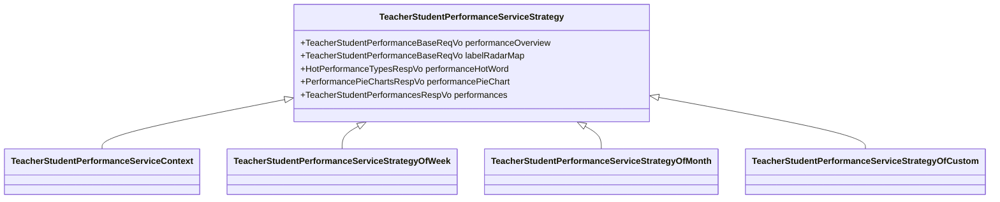

# 在业务中落地设计模式-策略模式

## 策略模式的介绍

策略模式通过定义不同的算法，并将每种算法隔离到独立的类中，以使每个类的职责更清晰更单一。

## 应用场景

- 期望在程序运行时动态切换不同的算法

## 业务需求 功能背景

教师数据报告

查询条件：按不同类型的时间进行查询 

- 按周
- 按月
- 按自定义

基于不同的查询类型（运行时动态改变） 查询存储的物化视图有所不同（算法实现不同）

完美契合策略模式的使用场景，那么接下来就开始聊聊设计细节和代码实现

## 不同角色的分配

在策略模式中，分不同的角色，各司其职

- 上下文：上下文的职责在于管理不同的策略实现类，在程序运行时动态调用不同的策略，可以类比 路由 统一入口以及分发不同的请求到不同的类中
- 策略接口：抽象定义算法的入参、出参，声明方法
- 策略具体实现类：实现策略 不同的场景使用不同的算法实现

## 类图

- 上下文： com.seewo.care.performance.school.administrator.service.impl.TeacherStudentPerformanceServiceContext
- 策略接口：com.seewo.care.performance.school.administrator.service.TeacherStudentPerformanceServiceStrategy
- 策略具体实现类：
  - 按周：com.seewo.care.performance.school.administrator.service.impl.TeacherStudentPerformanceServiceStrategyOfWeek
  - 按月：com.seewo.care.performance.school.administrator.service.impl.TeacherStudentPerformanceServiceStrategyOfMonth
  - 按自定义：com.seewo.care.performance.school.administrator.service.impl.TeacherStudentPerformanceServiceStrategyOfCustom
- 抽象父类（策略具体实现类的父类）：com.seewo.care.performance.school.administrator.service.AbstractTeacherStudentPerformanceService

